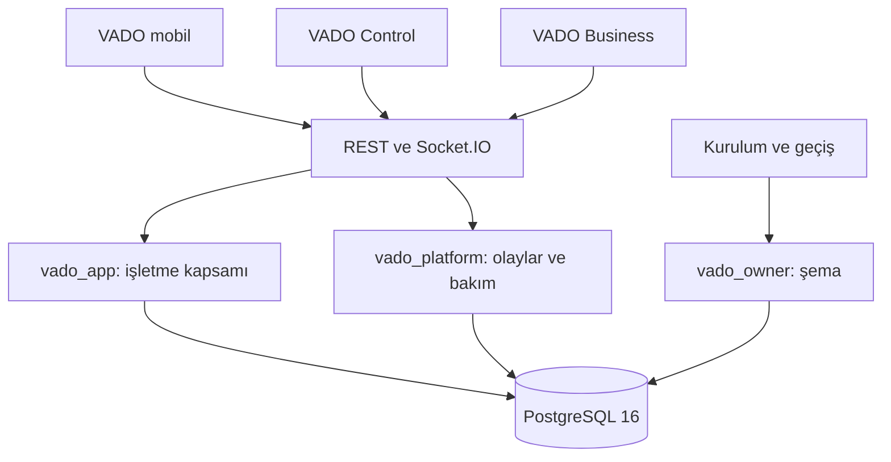

# Mimari

Bu belge parçaların nasıl birleştiğini ve önemli kararların gerekçesini anlatır. Kodun nasıl
yazılacağı [KOD_STANDARTLARI.md](KOD_STANDARTLARI.md), uç noktaların listesi [API.md](API.md)
belgesindedir.

## Büyük resim



Dört kural her yerde geçerlidir:

1. **Sözleşme tek yerde durur.** İstek ve yanıt şemaları, hata kodları ve Türkçe hata iletileri
   `packages/contracts` içindedir. API isteği bu şemalarla doğrular, mobil uygulama ve panel aynı
   tipleri kullanır. Bir alan değiştiğinde derleyici üç tarafı da uyarır.
2. **REST yazar, soket iter.** Her değişiklik bir REST isteğiyle yapılır. Soket yalnızca "şu değişti"
   haberini taşır; soketten veri yazılmaz (tek istisna, kalıcı olmayan "yazıyor" bildirimidir).
   Böylece bağlantı kopsa da veri kaybolmaz: uygulama yeniden bağlanınca listeleri tazeler.
3. **Güvenlik sunucuda doğrulanır.** Mobil uygulamadaki her denetim (yetki, kişi olma, tutar)
   API'de yeniden yapılır. İstemci yalnızca kullanıcıya erken bilgi vermek için denetler.
4. **Mini uygulamaya güvenilmez.** Mini uygulama başkasının yazdığı koddur; incelenmiş olsa da
   yalıtılmış çalışır ve VADO'nun oturum belirtecini, telefon numarasını veya kart bilgisini hiçbir
   zaman görmez.

## Depo düzeni

npm çalışma alanları (workspaces) kullanılır. `@vado/contracts` ve `@vado/miniapp-sdk` paketleri
derlenmeden, TypeScript kaynağı olarak tüketilir; ara derleme adımı ve eskimiş çıktı sorunu yoktur.

```
apps/api/src
  core/        yapılandırma, veritabanı, hata, güvenlik, anahtarlar, şema yükseltme: iş kuralı içermez
  modules/     her alan için <ad>.service.ts (iş kuralları) ve <ad>.routes.ts (HTTP)
  providers/   dış dünyaya açılan arayüzler: SMS, dosya depolama, paket deposu
  realtime/    Socket.IO sunucusu
  cli/         komut satırı betikleri: şema yükseltme, örnek veri, anahtar yönetimi, panel
               hesapları, paketleme, paket deposu denetimi
  app.ts       uygulamayı kurar; main.ts yalnızca başlatır ve kapatır

apps/mobile/src
  app/         ekranlar (dosya adı = adres; Expo Router)
  features/    alan mantığı: sorgular, depolar, alana özgü bileşenler
  ui/          alan bilmeyen ortak bileşenler (düğme, satır, sayfa)
  theme/       renk, boşluk ve yazı belirteçleri
  api/         HTTP istemcisi ve sorgu önbelleği
  lib/         saf yardımcılar (biçimlendirme, Türkçe metin)

apps/portal
  app/         sayfalar (Next.js App Router): (auth) giriş sayfaları, (panel) giriş gerektirenler
  lib/         API istemcisi, sunucu işlevleri, oturum çerezi
  components/  ortak bileşenler

miniapps/appointment   örnek mini uygulama; derleme çıktısı örnek paket olarak yüklenir
```

Bağımlılık yönü tek taraflıdır: `app → features → ui/lib/api/theme`. `ui` hiçbir alanı tanımaz;
bir alan başka bir alanın iç dosyalarına değil, dışa açtığı işlevlere bağlanır.

## API

### İstek akışı

```
İstek → Fastify (helmet, CORS, hız sınırı) → rota
      → parse(şema, gövde)                  geçersizse validation_failed
      → guard(istek)                         oturum yoksa unauthorized
      → servis işlevi                        iş kuralı bozulursa AppError(kod)
      → yanıt  |  hata → { error: { code, message, details? } }
```

Rotalar ince tutulur: girdiyi doğrular, oturumu alır, servisi çağırır. İş kuralları yalnızca servis
dosyalarındadır ve HTTP'den habersizdir; bu yüzden testler ve örnek veri betiği aynı servisleri
doğrudan çağırabilir.

Servisler sınıf değil, bağımlılıklarını parametre alan işlevlerdir (`createChatService(context)`).
Tüm servisler `services.ts` içinde tek yerde kurulur; gizli bir genel durum yoktur.

### Veritabanı

Sorgular `sql` etiketiyle yazılır; araya konan her değer bağlı parametreye dönüşür, metne karışmaz:

```ts
const user = await db.maybeOne<UserRow>(sql`select * from users where id = ${id}`);
```

ORM kullanılmadı. Sorguların çoğu (sohbet listesi, akış) birleştirme ve alt sorgu ister; SQL'in
kendisi hem daha kısa hem de daha kolay denetlenir. Satır tipleri sorgunun yanında tanımlanır.

Şema `apps/api/migrations/NNNN_aciklama.sql` dosyalarındadır. Geliştirmede API açılırken bekleyen
dosyaları kendisi uygular. Canlı ortamda uygulamaz; bekleyen dosya varsa başlamayı reddeder.
Böylece şema değişikliği her zaman bilinçli bir adımdır (`migrate` servisi, bkz. YAYIN.md).

Önemli tablo kararları:

- `users` silinmez, boşaltılır: hesap silindiğinde telefon, ad, kimlik ve fotoğraf temizlenir,
  `status = 'deleted'` olur. Eski mesajlar karşı tarafta "Silinmiş Hesap" adıyla kalır.
- `contacts` her arkadaşlık için iki satır tutar (iki yön). Sorgular basit kalır.
- `conversations.direct_key` iki kişi arasında tek sohbet olmasını veritabanı düzeyinde garanti eder.
- `messages.seq` tüm sohbetlerde ortak artan sıra numarasıdır. Sıralama, sayfalama ve okundu bilgisi
  buna dayanır; saat farkları sırayı bozamaz.
- `messages (sender_id, client_id)` benzersizdir: aynı mesaj iki kez gönderilse de bir kez kaydedilir.
- Grup sistem mesajlarında ("Ayşe grubu oluşturdu") metin saklanmaz, olay saklanır
  (`system_event`). Metin okunurken güncel adlarla üretilir; ad değişikliği ve hesap silme eski
  mesajlara da yansır.
- `audit_log` panelden yapılan her işlemi ve önemli kullanıcı işlemlerini kalıcı olarak tutar.
  `actor` sütunu panel hesabının ya da kullanıcının kimliğini (ya da `admin`, `cli` gibi bir sistem
  adını) taşır; yanıtlarda bu değer tek sorguda hesabın adına çevrilir (`resolveActors`).
- `admin_accounts`, `admin_sessions`, `admin_recovery_codes` panel hesaplarıdır; kullanıcılardan
  (`users`, `sessions`) tamamen ayrıdır. Hesap silinmez, kapatılır; son etkin sahip hesabını
  kaldıran güncellemeyi tetikleyici reddeder.
- `admin_accounts.business_id` (2.5) işletme hesabının kapsamıdır: rol `business` ise dolu, değilse
  boştur (kısıt); açıldıktan sonra değişmez (tetikleyici).
- `push_tokens` (2.5) bildirim adresini oturuma bağlar: oturum kapanınca tetikleyici satırı siler,
  adres yalnızca sahibinin açık oturumuna yazılabilir.
- `package_versions` ve `package_files` yüklendikten sonra değişmez; bu, uygulama kodunda değil
  veritabanı tetikleyicilerinde de uygulanır (aşağıda, Mini uygulamalar bölümünde).
- `mini_app_releases` yalnızca eklenir: bir uygulama kaydının her yayını, ayar değişikliği ve geri
  alması birer satırdır. `mini_app_runtime` görünümü, kaydın o anda geçerli yetkilerini, sürümünü ve
  içerik özetini tek yerden verir; kullanıcıya dönük her sorgu bu görünümü okur.

### Oturum ve giriş

- Giriş SMS koduyladır. Kod veritabanında düz metin değil, doğrulama kodu anahtarıyla alınmış özet
  olarak durur. Bir numaraya kullanılmamış bir kod varken 60 saniye yenisi gönderilmez; on dakikada numara
  başına 5, IP başına 20 kod sınırı vardır; bir kod en fazla 5 kez denenebilir.
- Oturum belirteci JWT değil, 256 bitlik rastgele bir değerdir; veritabanında yalnızca SHA-256 özeti
  saklanır. Sunucu her istekte oturuma baktığı için oturumu kapatmak anında etkili olur; JWT'de
  bunun için ayrıca bir kara liste gerekirdi.
- Hesap askıya alındığında veya silindiğinde tüm oturumlar kapanır ve açık soket bağlantıları
  düşürülür.

### İmza anahtarları

- Sunucu dört şeyi gizli anahtarla imzalar: doğrulama kodunun özetini, QR kodunu, mini uygulama
  kimliğini ve mini uygulama kimlik belirtecini (2.5). Her birinin anahtarı ayrıdır (`core/keys.ts`); biri sızarsa ya da değiştirilirse diğerleri
  etkilenmez. Servisler anahtarları `context.keys` üzerinden kullanır, ortam değişkenini okumaz.
- Doğrulama kodu ve QR anahtarları halkadır: ilk anahtar imzalar, imza anahtarın kimliğini taşır,
  halkadaki eski anahtarlar belirlenen güne kadar yalnızca doğrular. Böylece anahtar, dolaşımdaki
  kodları geçersiz kılmadan değiştirilir.
- Kimlik belirteci (`core/identity-tokens.ts`) bir JWT'dir ve Ed25519 ile imzalanır; doğrulayan
  taraf (mini uygulamanın sunucusu) VADO'nun dışında olduğu için simetrik anahtar değil, açık
  anahtarı yayımlanabilen bir imza seçildi. Halkanın 32 baytlık değerleri Ed25519 tohumudur; açık
  anahtarlar `GET /v1/identity-keys` adresinden JWK olarak yayımlanır. Yeni bir kripto kitaplığı
  eklenmedi; imza Node.js'in kendi `crypto` modülüyle atılır.
- Mini uygulama kimliği anahtarı bilinçli olarak halka değildir. Kimlik saklanmaz, anahtardan
  hesaplanır; anahtarın değişmesi kimliğin değişmesi demektir. Bu yüzden tek ve uzun ömürlüdür.
- Oturumların anahtarı yoktur: belirteç imzalı bir veri değil, rastgele bir değerdir ve
  veritabanındaki özetiyle doğrulanır. Değiştirilecek ya da sızacak bir oturum anahtarı olmaz.
- Canlı ortamda anahtarlar eksik, zayıf ya da ortaksa API başlamaz. Biçim, eski sistemden geçiş ve
  değiştirme adımları [ANAHTARLAR.md](ANAHTARLAR.md) belgesindedir.

### Gerçek zamanlı katman

Her bağlantı kendi kullanıcısının ve oturumunun odasına girer (`user:<id>`, `session:<id>`).
Servisler `realtime.emit(kullanıcılar, olay, veri)` çağırır; kimin bağlı olduğunu bilmeleri gerekmez.
`REDIS_URL` tanımlıysa Socket.IO'nun Redis bağdaştırıcısı devreye girer ve olaylar tüm API
süreçlerine dağılır; tek süreçte Redis gerekmez.

İstemci tarafında olaylar ekranlara değil, sorgu önbelleğine işlenir. Ekranlar veriyi her zaman
önbellekten okur; olay kaçsa bile yeniden bağlanınca yapılan tazeleme durumu düzeltir.

### Dosyalar

Fotoğraflar `StorageProvider` arayüzü üzerinden yazılır. Varsayılan uygulama yerel diske yazar ve
dosyaları API üzerinden sunar. Dosya türü, istemcinin beyanına değil içeriğin ilk baytlarına bakılarak
belirlenir; yalnızca JPEG, PNG ve WebP kabul edilir. Bir fotoğraf artık hiçbir mesajda, paylaşımda
veya profilde kullanılmıyorsa (paylaşım silindi, profil fotoğrafı değişti, hesap silindi) kaydı ve
dosyası da silinir.

Çok sunuculu kurulumda aynı arayüzü uygulayan bir S3 sağlayıcısı yazılmalıdır (bkz. YOL_HARITASI.md).

Mini uygulama paketlerinin dosyaları ayrı bir depoda (`PackageStore`, `VADO_PACKAGE_DIR`) durur ve
fotoğraflarla karışmaz; ayrıntısı aşağıdadır.

## Mini uygulamalar

Mini uygulama, başkasının yazdığı bir web uygulamasıdır. Kodu geliştiricinin sunucusunda durmaz:
derlenmiş hâli bir paket olarak VADO'ya yüklenir, incelenir ve VADO'nun sunucusundan sunulur. Kabuk
telefonda bir WebView içinde (tarayıcı önizlemesinde `iframe` içinde) VADO'nun sarmalayıcı
belgesini açar; paket onun içindeki korumalı çerçevede çalışır ve kabukla küçük bir köprü üzerinden
konuşur. Geliştiricinin gözünden anlatımı
[MINI_UYGULAMA_GELISTIRME.md](MINI_UYGULAMA_GELISTIRME.md) belgesindedir.

### Paket ve uygulama kaydı

İki kavram bilinçli olarak ayrıdır:

- **Paket** incelenen koddur (`packages`). Her sürümü (`package_versions`) kökündeki
  `vado.app.json` bildirim dosyasıyla birlikte yüklenir: istediği yetkiler, bağlanacağı adresler ve
  işletmelerden beklediği ayar alanları orada yazar.
- **Uygulama kaydı** (`mini_apps`) bir işletmenin vitrinidir: ad, simge, ayarlar, satıcılar ve
  yayınladığı paket sürümü. Kullanıcının Keşfet'te gördüğü, QR kodunun gösterdiği ve ödemenin
  bağlandığı şey kayıttır.

Binlerce işletme aynı paketi kullanabilir; kod bir kez incelenir, işletmeler yalnızca ayarlarıyla
ayrışır. Kullanıcı kimliği (`openId`), izinler, cihazdaki depolama ve satıcılar pakete değil kayda
bağlıdır: aynı paketi kullanan iki işletme birbirinin kullanıcısını ya da verisini göremez.

```
 yükleme ──► taslak ──► incelemede ──► onaylı ──► kayıtta yayın ──► kabuk açar
                │            │            │
                │            └► reddedildi └► geri çekildi (yayınlayan kayıtlar kapanır)
                └► vazgeçildi
```

Bir kayıt, açık ve doğrulanmış olduğunda ve **onaylı** bir sürüm yayınladığında kullanıcılara
açıktır. Bu kural tek yerde tanımlıdır (`miniAppLive`); liste, açılış, kimlik, ödeme, QR ve dosya
sunumu aynı koşulu kullanır. Bu yüzden acil kapatma tek bir işlemdir: kaydı kapatmak ya da sürümü
geri çekmek, bir sonraki istekte hepsini birden keser.

Geliştiricinin kendi sunucusundan açılan kayıtlar (`source = 'url'`) geliştirme döngüsü için durur
ve yalnızca geliştirme kipinde (`VADO_MINIAPP_DEV_MODE`) çalışır; canlı ortamda bu kip açılamaz.

### Değişmezlik

"İncelenen kod ile çalışan kod aynıdır" güvencesi üç katmanda tutulur:

- **Kimlik içeriktir.** Sürümün özeti, dosyaların yol, boyut ve SHA-256 değerlerinden hesaplanır
  (`packageDigestInput`); arşivin nasıl sıkıştırıldığından bağımsızdır. Özet, paketin sunulduğu
  adresin parçasıdır.
- **Depo içerik adreslidir** (`providers/package-store.ts`). Her dosya kendi SHA-256 değeriyle
  adlandırılır; geçici bir dosyaya yazılıp diske işlendikten sonra sabit bağlantıyla (hard link)
  yerine konur. Bağlama, hedef varsa başarısız olur: bir adres ya hiç yoktur ya da tam ve doğru
  içeriği taşır, üzerine yazılamaz. Depoda silme işlemi yoktur; dosyalar salt okunur yazılır ve her
  okumada özetleri yeniden doğrulanır. Bozulmuş ya da eksik dosya sunulmaz.
- **Veritabanı da izin vermez.** Tetikleyiciler sürümün içerik sütunlarının ve dosya satırlarının
  değişmesini, silinmesini ve durumun geriye gitmesini reddeder; taslak incelemeye geçerken dosya
  listesinin özeti veritabanında yeniden hesaplanır. Uygulamadaki bir hata ya da elle yazılmış bir
  SQL de onaylı sürümü değiştiremez.

Yayın geçmişi bir geri alma yığını gibi okunur (`release-history.ts`): yayın yığına ekler, ayar
değişikliği en üsttekini değiştirir, geri alma en üsttekini atar. Geri alınan kayıt, önceki sürüme
o sürümle en son kullanılan ayarlarla döner; arada geri çekilmiş sürümler atlanır.

### Sunum ve yalıtım

Kabuk paketi doğrudan açmaz. Her kaydın yayındaki sürümü iki adresten, oturumsuz sunulur:

- `GET /apps/<kayıt>/wrapper/<özet>/`: **sarmalayıcı belge**. VADO'nun ürettiği küçük bir sayfadır;
  içinde yalnızca paketin çerçevesi ve köprüyü aktaran kısa bir betik bulunur. Kabuğun açtığı adres
  budur (`MiniApp.entryUrl`).
- `GET /apps/<kayıt>/files/<özet>/<dosya>`: paketin dosyaları. Giriş belgesi sarmalayıcının
  çerçevesine yüklenir.

```
Kabuk (WebView ya da web önizlemesi)
└─ sarmalayıcı belge      VADO'nun kodu; kendi kaynağında
   └─ paketin çerçevesi   güvenilmeyen kod; kum havuzunda, kimliksiz kaynakta
```

Neden iki belge: bir sayfanın kendi penceresini başka adrese götürmesini o sayfanın güvenlik
politikası engelleyemez; ama onu çerçeveleyen sayfanınki engeller. Sarmalayıcı bu yüzden vardır.

Yalnızca kaydın o an yayındaki sürümü sunulur ve adresler sürümün içerik özetini taşır; yeni sürüm
yeni adrestir. Sarmalayıcı belge ve paketin giriş belgesi her açılışta sunucuya sorulur
(`no-cache`): geri çekilen sürüm ve değişen güvenlik başlıkları hemen geçerli olur. Paketin diğer
dosyaları değişmez sayılır ve süresiz önbelleklenir.

Yalıtım tek bir mekanizmaya dayanmaz; katmanlar birbirini tamamlar:

1. **Kimliksiz kaynak.** Paketin çerçevesi kum havuzundadır (`sandbox`): belge kimliksiz (opak)
   bir kaynakta çalışır; çerezi, tarayıcı deposu ve Service Worker'ı yoktur. Yeni pencere açamaz,
   kendisini çerçeveleyen sayfaları başka adrese götüremez; API ile ve başka kayıtlarla aynı alan
   adından sunulsa bile onların hiçbir verisini okuyamaz.
2. **Sarmalayıcının çerçeve kısıtı.** Sarmalayıcının politikası çerçeveye yalnızca paketin giriş
   belgesinin yüklenmesine izin verir (`frame-src <giriş belgesi>`). Tarayıcı motoru bunu paketin
   kendi başlattığı gezinmelere de uygular ve başka adrese giden isteği göndermeden reddeder.
3. **Paketin güvenlik politikası.** Giriş belgesiyle gönderilen `Content-Security-Policy`,
   kaynakları `'self'` ile değil paketin kendi klasörüyle sınırlar: kod yalnızca o klasörden
   çalışır, ağ yalnızca o klasöre ve bildirim dosyasındaki adreslere gider, paket başka bir sayfayı
   çerçeveleyemez. Paket, VADO'nun API'sini ya da başka bir kaydın dosyalarını çağıramaz. Giriş
   belgesi dışındaki dosyalar belge olarak açılırsa etkisizdir.
4. **Sarmalayıcının köprü kuralı.** Sarmalayıcı yalnızca çerçevesinden gelen ilk bağlantıyı kabul
   eder. Çerçeveden ikinci bir bağlantı isteği gelirse ya da tarayıcı çerçeve kısıtının ihlalini
   bildirirse çerçeveyi kaldırır ve kabuğa `left` bildirimi gönderir; kabuk mini uygulamanın
   penceresini kapatır. Paket bu yüzden tek belgedir: sayfa yenilemek ya da başka bir HTML dosyasına
   geçmek mini uygulamayı kapatır; sayfa değişmeden yapılan gezinme serbesttir.
5. **Kabuktaki kilit.** Telefondaki WebView görünümde yüklenen adresleri kapsam denetiminden
   geçirir (iOS'ta her çerçeve, Android'de yalnızca ana sayfa); kapsam dışındaki adres açılmaz,
   sistem tarayıcısına da devredilmez. Ana sayfa sarmalayıcıdan başka bir sayfa olursa kabuk
   görünümü kaldırır. Köprü iletisi yalnızca sarmalayıcıdan geldiyse işlenir. Yeni pencere, dosya
   erişimi, konum, kamera ve mikrofon kapalıdır.
6. **Alt alan adı (isteğe bağlı).** `VADO_APPS_ORIGIN` ayarlanırsa her kayıt kendi alan adından
   sunulur (`https://<kayıt>.mini.ornek.com`); kayıtlar tarayıcının kaynak (origin) ayrımıyla da
   ayrılır ve API'nin alan adından tamamen çıkar.
7. **Yetkiler ve izin.** Her köprü metodu bir yetkiye bağlıdır; paketin bildirmediği yetki
   reddedilir. Kimlik, kamera ve konum için kullanıcıya ayrıca sorulur. İzin, kaydın yetkilerinin
   ve bağlanabildiği adreslerin özetiyle (`consentKey`) birlikte saklanır; yeni bir sürüm bunları
   değiştirirse izin geçersiz olur ve yeniden sorulur.
8. **Takma kimlik.** Mini uygulama kullanıcının gerçek kimliğini değil, o kayda özel bir `openId`
   görür. İki kayıt aynı kullanıcıyı birbirleriyle eşleştiremez. Kimlik, yalnızca bu işe ayrılmış
   uzun ömürlü bir anahtarla türetilir; saklanmaz, her istekte yeniden hesaplanır.
9. **Zarfta kimlik yok.** İletide "ben şu mini uygulamayım" alanı yoktur; kabuk, isteğin hangi
   pencereden geldiğini kendisi bilir.

**Köprünün yolu.** Paketin SDK'sı ilk çağrıda üst penceresine (sarmalayıcıya) bir ileti kapısı
(MessagePort) verir; istekler ve yanıtlar yalnızca o kapıdan geçer. Sarmalayıcı gelen isteği kabuğa
aktarır: telefonda WebView'in ileti kanalına yazar ve kabuğun pencereye bıraktığı yanıtı kapıya
iletir; web önizlemesinde kabuğun sayfasına kendi kapısını verir. WebView'in ileti nesnesi
Android'de paketin çerçevesinde de görünür; kabuk yalnızca sarmalayıcının kaynağından gelen iletiyi
işlediği için paket onu kullanamaz. Sarmalayıcının betiği tarayıcıya metin olarak gider ve
politikada içerik özetiyle tanımlanır (`wrapper-document.ts`); davranışı birim testlerinde aynı
metin çalıştırılarak sınanır.

Yüklemedeki otomatik inceleme (`package-analysis.ts`) inceleyene yol gösterir, güvence değildir:
`eval`, tarayıcı deposu ya da dış adres gibi kalıpları işaretler. Orada "engellenir" diye
işaretlenen her şey, bulgu gözden kaçsa da yukarıdaki katmanlarca çalışma anında engellenir.
"İncele" bulguları kararı inceleyene bırakır; bunların içinde çalışma anında engellenemeyen tek
kullanım WebRTC'dir.

Bu katmanların neyi engellediği iki tarayıcı motorunda ölçüldü. Sonuçlar, açık kalan yollar
(WebRTC, Android'de tek katmana dayanan gezinme engeli) ve gerçek cihazda sınanmamış olanlar
[SECURITY.md](../SECURITY.md) belgesinde açıkça yazılıdır.

```
Mini uygulama                      VADO kabuğu                         API
  vado.payment.request(...)  ──►  paket bu yetkiyi bildirmiş mi?
                                  parametreler şemaya uyuyor mu?
                                  ödeme ekranını aç            ──►   POST /v1/payments
                                  kullanıcı onaylar            ──►   POST /v1/payments/:id/confirm
  { paymentId, status }      ◄──  yanıt
```

Protokolün tamamı `packages/contracts/src/bridge.ts` dosyasındadır; kabuk ve SDK aynı tanımı kullanır.

### Sonraki sürümlere açık yerler

Paket platformu, yol haritasındaki adımlar kırılmadan eklenebilecek biçimde kuruldu:

- **İnceleyen kimliği.** Yükleme, gönderme, karar ve yayın kayıtları "kim yaptı" bilgisini taşır;
  2.4'ten beri bu sütunlara panel hesabının kimliği yazılır (önceki kayıtlarda `admin`).
- **Bağlantı parametreleri.** 2.5'te dolduruldu: panelden üretilen QR kodunun imzalı parametreleri
  `app.getContext().params` olarak gelir. Mobil uygulama parametreleri ekran adresine yazmaz;
  taramadan sonra bellekte bir "açılış" kaydı tutar ve adrese yalnızca onun anahtarını koyar
  (`features/miniapps/launch-params.ts`).
- **Depo sağlayıcısı.** `PackageStore` arayüzü iki işlemden ibarettir (`put`, `read`); S3 uyumlu bir
  depoya koşullu yazma ve nesne kilidiyle taşınabilir.

## Ödeme

Ödeme almak Türkiye'de lisansa bağlıdır (bkz. TURKIYE_UYUM.md). Bu yüzden VADO kart bilgisi
toplamaz ve para tutmaz; tasarım bu sınıra göre kuruldu:

- Mini uygulama yalnızca satıcı kimliği, sipariş numarası, açıklama ve tutar bildirir.
- API, kaydın kullanıcılara açık olduğunu, satıcının o uygulama kaydına panelden bağlanmış ve
  etkin olduğunu denetler; aynı sipariş numarasıyla ikinci bir ödeme açılmaz.
- Onay VADO'nun kendi ekranında verilir; mini uygulama onay ekranını çizemez.
- `sandbox` kipinde onay, ödemeyi doğrudan "ödendi" yapar; gerçek para hareketi olmaz.
- `provider` kipinde ödeme oturumu açılmaz (501 döner). Lisanslı kuruluşun ödeme sayfası bağlandığında
  bu kipin içi doldurulur: API kuruluşta oturum açar, kullanıcı kuruluşun sayfasında öder, kuruluşun
  sunucudan sunucuya bildirimi ödemeyi "ödendi" yapar.

## QR kodlar

QR kodun içeriği `vado://q/<yük>.<anahtar kimliği>.<imza>` biçimindedir. Yük, hedefin türünü ve
kimliğini taşır; sunucu QR anahtarıyla imzalar. Anahtar kimliği, anahtar değiştirildikten sonra da
eski kodların doğru anahtarla doğrulanmasını sağlar. Kişisel kodlar kısa ömürlüdür (varsayılan 10 dakika) ve ekranda
kendiliğinden yenilenir; böylece bir ekran görüntüsü sonsuza kadar geçerli kalmaz. İşletme ve mini
uygulama kodları süresizdir ama hedef kapatıldığında çalışmaz. Kod her zaman sunucuda çözülür;
uygulama içeriğe güvenmez. Panelden üretilen mini uygulama kodunun yükünde imzalı parametreler
(`p`) de bulunabilir; parametresiz kodun yükü önceki sürümlerle birebir aynıdır.

## Anlık bildirimler

Sağlayıcı bir arayüzdür (`providers/push.ts`): `send(iletiler) → sonuçlar`. Geliştirmede `log`
sağlayıcısı yalnızca günlüğe yazar, testler sahte sağlayıcı verir, canlıda `expo` sağlayıcısı
Expo Push Service'e 100'lük gruplar halinde gönderir. Doğrudan FCM/APNs'e geçmek yalnızca yeni bir
sağlayıcı yazmaktır.

`modules/notifications` mesaj ve yeni cihaz olaylarında alıcıları tek sorguda bulur (sohbet üyeleri,
açık oturumlarındaki adresler, kullanıcının güncel ayarları) ve SQL outbox dağıtıcısıyla gönderir; isteği yapan
kullanıcı beklemez, sağlayıcı hatası yanıta yansımaz. Sağlayıcı bir adresi geçersiz sayarsa adres
silinir. Testler gönderimin bitmesini `notifications.idle()` ile bekler.

Mobil uygulama oturum açıkken izni (cihazda bir kez) sorar, adresi `PUT /v1/me/push-token` ile
yazar ve bildirime dokunulunca verisini sözleşme şemasıyla çözüp ilgili ekranı açar
(`features/notifications`). Tarayıcı önizlemesinde bildirim yoktur (`push.web.ts`).

## Mobil uygulama

- **Yönlendirme:** Expo Router; dosya adı adrestir. Giriş yapmamış kullanıcı yalnızca `(auth)`
  ekranlarını, adını girmemiş kullanıcı yalnızca ad ekranını görebilir (`Stack.Protected`).
- **Sunucu verisi:** TanStack Query. Ekranlar `useConversations()` gibi kancalar kullanır; `fetch`
  çağrısı ekranlarda bulunmaz.
- **Gönderilmekte olan mesajlar:** sunucuya ulaşana kadar küçük bir yerel depoda (`outbox`) durur ve
  sohbette soluk gösterilir. Gönderim başarısız olursa kullanıcı dokunarak yeniden dener; aynı
  `clientId` kullanıldığı için mesaj çoğalmaz.
- **Görsel dil:** renk, boşluk ve yazı boyutları `theme/tokens.ts` içindedir; ekranlarda doğrudan
  renk yazılmaz. Listeler kart içine alınmaz, ince çizgiyle ayrılır. İznik çinisi paletinden gelen
  çini yeşili ana renktir; mercan yalnızca dikkat isteyen yerlerde (okunmamış rozeti, geri alınamaz
  eylem) kullanılır. Selçuklu "yıldız ve haç" örgüsü yalnızca karşılama ekranında, QR kartında ve
  panelin marka alanında görünür.
- **Platform farkları** `*.web.tsx` dosyalarıyla ayrılır (kamera, WebView, güvenli depolama); ekranlar
  platformu bilmez.

## Yönetim paneli

Panel tarayıcıdan API'ye doğrudan bağlanmaz. Sayfalar sunucuda çizilir; panel sunucusu API'yi
yönetici anahtarıyla çağırır. Anahtar tarayıcıya hiç gitmez.

### Hesaplar, oturum ve yetki

Kimliği API doğrular. Hesaplar, parolalar, ikinci adım ve oturumlar API'nin veritabanında durur
(`modules/admin-accounts`). Panel yalnızca yöneticinin oturum belirtecini taşır:

```
Tarayıcı ──(çerez: oturum belirteci)──► Panel sunucusu ──(anahtar + Bearer belirteç)──► API
                                                                     oturum geçerli mi?
                                                                     hesap etkin mi?
                                                                     rolde bu izin var mı?
```

- **Giriş iki adımdır.** Parola doğrulanınca yalnızca ikinci adıma yarayan bir yarım oturum açılır
  (`stage = 'second_factor'`). İkinci adım (TOTP ya da kurtarma kodu) geçilince yarım oturum
  kapanır ve yeni bir belirteçle tam oturum açılır. Panel iki belirteci ayrı çerezlerde tutar.
- **İki katman.** Yönetici anahtarı isteğin panel sunucusundan geldiğini, oturum isteği yapan
  hesabı kanıtlar. Panelin sunucu işlevleri doğrudan POST isteğiyle de çağrılabildiği için yetki
  panelde değil, her çağrıda API'de denetlenir; panelin `proxy.ts` dosyası yalnızca oturumu
  olmayanı giriş sayfasına gönderir.
- **İzin uçta bildirilir.** İzin listesi ve rol-izin tablosu sözleşmededir
  (`ADMIN_ROLE_PERMISSIONS`). Her yönetim ucu rota ayarında gerektirdiği erişimi yazar
  (`adminAccess("packages.review")`, ya da `session`, `second_factor`, `public`).
  `collectAdminRoutes`, erişim bildirmeyen bir `/v1/admin/` ucunu kayıt sırasında reddeder;
  `adminGuard` anahtarı, oturumu ve izni ucun bildirdiğine göre denetler. Bildirilen erişimlerin
  listesi testlere açıktır: izin tablosu testi her ucu her rolle çağırır.
- **Yetki ve kapsam ayrıdır.** Rol "ne yapılabilir" sorusunu yanıtlar, kapsam "hangi kayıtlar
  üzerinde". VADO ekibinin hesaplarının kapsamı yoktur. İşletme hesabının (2.5) kapsamı bağlı
  olduğu işletmedir; `adminGuard` bunu `AdminContext.businessId` olarak verir, kapsamı uygulayan
  uçlar servise geçirir ve servis kayıtları süzer (`miniapp-admin.service.ts`, `scopeFilter`:
  kayıt, işletmenin satıcı olarak bağlı olduğu kayıtsa kapsamdadır). Kapsamı uygulayan izinler
  sözleşmede listelidir (`SCOPED_PERMISSIONS`); kapsamlı bir hesap bu listede olmayan bir izni
  isteyen uca, rolünde o izin olsa bile giremez. Yeni bir uç kapsamlı rollere açılacaksa önce
  servisine kapsam süzgeci yazılır, sonra izni listeye eklenir.
- **Dört göz.** Paket sürümünü yükleyen (`uploaded_by`) ya da incelemeye gönderen
  (`submitted_by`) hesap onu onaylayamaz. Servis kuralı denetler; `package_versions_review_guard`
  tetikleyicisi aynı kuralı veritabanında uygular.

API'den gelen her yanıt sözleşme şemasıyla doğrulanır; panel ile API'nin sürümleri uyuşmazsa bu,
sessiz bir boş ekran olarak değil, açık bir hata olarak ortaya çıkar. Oturum geçersizse panel giriş
sayfasına, parolanın değişmesi gerekiyorsa "Hesabım" sayfasına, rolün göremediği bir bölüm
açılırsa yetki sayfasına gider.

Paket incelemesi panelde yapılır: sürümün dosyaları, istediği yetkiler, bağlanacağı adresler,
otomatik bulgular ve önceki onaylı sürüme göre fark aynı sayfada görünür. Paket dosyaları panelde
çalıştırılmaz, yalnızca metin olarak gösterilir. Yükleme de panelden geçer; panel dosyayı API'ye
iletir, kuralları API uygular.

## Test yaklaşımı

- **Sözleşmeler:** telefon numarası, şema ve köprü protokolü birim testleri.
- **API:** her test dosyası kendi uygulama örneğini kurar; testler gerçek bir PostgreSQL
  veritabanında, HTTP katmanından geçerek çalışır. Sahte veritabanı yoktur. Gerçek zamanlı testler
  gerçek soket bağlantıları açar. Paket testleri gerçek zip arşivleri (bozuk ve kötü niyetli
  olanlar dahil) yükler, depodaki dosyaları bozar ve değişmezlik kurallarını doğrudan SQL ile
  zorlar.
- **Mobil:** telefondan bağımsız mantık (köprü, sohbet listesi, biçimlendirme) birim testleriyle
  sınanır. Ekranlar tarayıcıda uçtan uca senaryolarla denendi; bu senaryolar depoya dahil değildir
  (bkz. YOL_HARITASI.md).

## 2.6 ilk aşama: platform temeli

`business-management` VADO hesabını üyelikle veya kabuk müşterisiyle doğrular ve `TenantScope`
üretir. Motor erişimi `withTenant` içinde işlem başına kapsam kurar; ayrı havuzdaki
`platformScope` yalnızca platform işleri içindir. Yeni uygulama örneği eski mini uygulama ve
satıcı kaydının işletme bağını bileşik yabancı anahtarla taşır. Şube ve haftalık çalışma
aralıkları işletmeye bağlıdır; gece ve hafta sınırı çakışmaları doğrudan SQL ile de reddedilir.
0008 eski işletme sahiplerini üyeliğe dönüştürür ve sonraki başvuruları otomatik bağlar.

## 2.6 ikinci aşama: katalog ve fiyat görüntüsü

0009 altı işletme tablosunu RLS/FORCE ile ekler. `catalog` yalnızca `TenantContext` (uygulama
bağlantısı) alır; platform bağlantısını alamaz. Kategori, ürün, grup, seçenek, ürün-grup bağı ve
fiyat bileşik yabancı anahtarlarla bağlanır. Fiyatlar genel veya şubeye özeldir; seçenek tutarı
satıra eklenir, vergi BigInt ile satır başına ayrılır. Fiyat görüntüsü, katalog satırlarını okuma
kilidiyle tutar. Fiyat ve bağ yazma tetikleyicileri üst kaydı kilitlediği için araya yeni bir şube
fiyatı eklenmesi de engellenir. Sepet ve sipariş aynı hesaplayıcıyı kullanacaktır.

## 2.6 kalıcı olay dağıtımı

`appendEvent(tx, TenantScope, data)` iş kaydının işlemi içinde olay yazar. Genel sohbet
ve girişte ayrı `appendPlatformEvent` vardır; işletme kimliğini nullable yaparak RLS
gevşetilmez. Ana süreç `services.events.start()` ile eski kuyruğu da tarar; süreç içi
hızlandırma yalnızca commit sonrasında çalışır ve kalıcılığın kaynağı değildir.

Dağıtıcı `FOR UPDATE SKIP LOCKED` ile kısa işlemde 30 saniye kira alır ve kilidi bırakır.
Teslimde tüketici adı + olay kimliği kaydı aranır. İç tüketicide etki ve teslim aynı
işlemde, dış tüketicide ağ çağrısından sonra yazılır. Kira belirteciyle koşullu teslim
onayı eski dağıtıcının yeni kirayı bitirmesini engeller. Hata artan bekleme, sekiz
deneme ve ölü kayıtla sonuçlanır; ölü önceki olay siparişin sonrakilerini bekletir.

Kayıtlı tüketiciler depodaki koddan kurulur. Webhook konfigürasyonu veri olarak alınır;
HTTPS zorunludur, yönlendirme izlenmez, her işletmenin alıcısı yalnızca kendi olayını
alır. Dış tüketicinin çift teslimi olağandır. Testlerde gerçek alt süreç SIGKILL ile
öldürüldü: iç etki bir kez, yerel HTTP alıcısında dış etki aynı kimlikle bir/iki kez oldu.

## 2.6 sipariş çekirdeği

`ordering` yalnızca `TenantContext` ve ortak katalog hesaplayıcısı alır. Sepet satırları
ürün/seçenek/adet ile bilgi amaçlı görülen fiyatı taşır. Okuma yeniden fiyatlar;
quote hash bütün fiyat görüntüsünü kapsar. Checkout anahtar kilidi → sepet yazma
kilidi → katalog okuma kilidi sırasını izler. Sipariş akışı ve paket kimlikleri
oluşturma anında görüntülenir; daha sonraki ayar değişimi mevcut siparişi değiştirmez.

0011 sipariş oluşturma ve her geçişte geçmiş + olayı otomatik ekler; ertelenmiş
kısıt tetikleyicisi satır toplamı/KDV/seçenek tutarını doğrular. Sonradan fiyat
satırı eklemek işlem kimliğiyle engellenir. Denetim tüketicisi etkisini ve teslimi
bir işlemde yazar. İşletmeler arası terk edilmiş sepet bakımı motor dışındaki
`tenant-maintenance` ve açık platform havuzundadır; 1000 kayıtla sınırlıdır.

## 2.6 bildirimsel paket derleyicisi

Statik `capabilities.registry` motor ve incelenmiş paket kodunu kurar. Manifest
JSON'dur; Zod yapılandırması sunucu kodunda kalır ve JSON Schema olarak
yayımlanır. Bağımlılıklar bu aşamada açık, tam yayımlanmış sürüm ister.
Çekirdek `accepted → completed` noktasını açar; hazırlık bu noktaya iki
ara adım ekler. Derleyici grafiği ve kayıtlı kural adlarını üretir. Sipariş
motoruna geçiş kuralı işlevi bağımlılık olarak verilir; motor kapsam
kurucusuna, platform havuzuna veya dağıtıcıya erişmez.

0012 yalnızca aynı iki incelenmiş grafiği kabul eden SQL işlevlerini ekler;
0011 değiştirilmez. Paket yazımı uygulama örneğini kilitler; müşteri işlemi
aynı örneği okuma kilidinde tutar. Ayar değişimi checkout fiyat/akış
görüntüsünün ortasına giremez. Business blokları etkin paketten ve yalnızca
veri ayarından türetilir; `stationLabel` blok başlığını belirler.

## İşletme uygulaması

`apps/business` Next.js sunucusu VADO kullanıcı oturumunu çerezde tutar. İşletme
seçimi güncel üyelikle doğrulanır. Sayfalar, rol ve manifestten gelen menü blokları
üzerinden açılır; paket ayar formları JSON Schema'dan üretilir. Aynı uygulama telefon,
tablet ve masaüstünde kullanılır. Canlı bağlantı kısa süreli ve tek kullanımlık
biletle açılır; outbox'taki sipariş olayı güncel üyelere küçük bir değişim sinyali
gönderir. Liste ve sipariş ayrıntıları yetkili HTTP isteğiyle yenilenir. Uygulama
kullanımı [BUSINESS.md](BUSINESS.md) belgesindedir.
